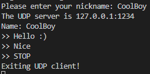
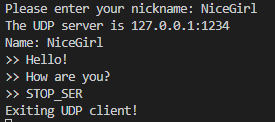
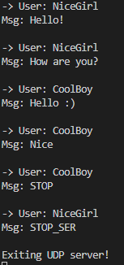

# IPv4-chat

## Описание

Программа представляет собой «IPv4-чат», обменивающуюся текстовыми широковещательными (IPv4 UDP broadcast) сообщениями по сегменту локальной сети.

Данная программа написана на языке программирования **Go** (версии 1.21.0), реализована в виде консольного приложения.

## Установка

1. Для установки необходимо распаковать zip-файл.

2. Далее, следует убедиться, что на Вашем устройстве установлен компилятор Go, для последующей работы с программой. Для этого в командной строке наберите:

    ```bash
    go version
    ```

    Если компилятор установлен, командная строка выдаст его версию:

    ```bash
    go version go1.21.0 (linux/windows/...)/amd64
    ```

    При выводе сообщения: ```command not found``` необходимо пройти по [ссылке](https://tip.golang.org/doc/install "Download and install - The Go Programming Language") и воспользоваться инструкцией по установке.

3. Программа состоит из 2 частей: серверной и клиентской.

    ***Установка серверной части.***

    1. Откройте терминал в папке IPv4-chat. Для перемещния введите команду:

        ```bash
        cd server/cmd/server
        ```

    2. Для сборки приложения введите команду:

        ```bash
        go build -buildvcs=false . && go install .
        ```

    3. После выполнения команды в папке ```server/cmd/server``` появится файл ```server.exe```.

    ***Установка клиентской части.***

    Происходит аналогично.

    1. Откройте терминал в папке IPv4-chat. Для перемещния введите команду:

        ```bash
        cd client/cmd/client
        ```

    2. Для сборки приложения введите команду:

        ```bash
        go build -buildvcs=false . && go install .
        ```

    3. После выполнения команды в папке ```client/cmd/client``` появится файл ```client.exe```.

## Запуск

1. Сначала необходимо запустить сервер. При запуске необходимо указать через пробел **номер порта**, на котором будет слушать сервер. Это делается с помощью команды:

    ```bash
    server.exe 1234
    ```

    где 1234 - пример номера порта. Номер порта может быть любым другим числом, по усмотрению.

2. Далее нужно запустить клиента. При запуске необходимо указать **номер хоста и порта** к которому подключается клиент, в формате host:port. Номер порта должен совпадать с указанным на сервере:

    ```bash
    client.exe 127.0.0.1:1234
    ```

    где 127.0.0.1:1234 - пример формата host:port.

3. Далее приложение попросит указать Ваше имя ```Please enter your nickname:```. Введите его и нажмите Enter.

4. При успешном соединении на клиентской части появится сообщение ```The UDP server is 127.0.0.1:1234```.

5. После чего, появятся значок ```>>```. Через него и можно отправлять сообщения. Каждое сообщение отправляется нажатием клавиши Enter.

6. Если Вы хотите закончить отправку сообщений, введите ```STOP```. Приложение клиента прекратит свою работу сообщением: ```Exiting UDP client!```.

7. Чтобы прекратить работу сервера необходимо со стороны клиента ввести ```STOP_SER```. Приложение сервера прекратит свою работу сообщением: ```Exiting UDP server!```.

### Альтернативный заупск

Приложения сервера и клиента можно запустить и без сборки. Для этого из папки IPv4-chat воспользуйтесь командами:

- Для сервера

    ```bash
    cd server/cmd/server && go run main.go 1234
    ```

- Для клиента

    ```bash
    cd client/cmd/client && go run main.go 127.0.0.1:1234
    ```

## Возможные ошибки и их обработка

1. При запуске сервера без указания номера порта или клиента - без номеров хоста:порта, программа завершится с ошибкой:

    ```Please provide a port number.```

    или

    ```Please provide a host:port string.```

    Решить эту ошибку можно только повторным запуском программы с указанием номера порта или номеров хоста:порта.

2. Ошибки, начинающиеся с сообщений ```Create connection failed``` и ```Connection to UDP address failed``` означают о невозможности установления соединения. Необходимо заново запустить приложение, с учётом ошибки (неправильное написание номера порта и т.д.).

3. Сообщение ```Listen failed``` предупреждает об ошибки соединения с сервером.

4. Сообщение ```Read data failed``` говорит о невозможности получения сообщения от клиента сервером.

5. Сообщение ```Write data failed``` - невозможность отправки сообщения клиентом.

### Пример работы программы

Здесь представлены скриншоты работающей программы.

Первый клиент:



Второй клиент:



Сервер:


